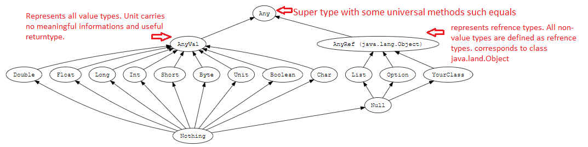

# learning-scala
Starting Scala Basic <br/>
---

**Declare variable and types**<br/>

**Immutable Variable**<br/>

**Meaning** - values which can not be changed<br/>
**Declaration** - val <name>:scala:Type = <some_Literal><br/>
**Example** - val name:String = 'Scala' <br/>
**Note** - Reassignment is not possible. 

---

**Mutable variable**<br/>

**Meaning** - value can be changed<br/>
**Declaration** - var <name>:scala:type=<some_literal><br/>
**Example** - var name:String = 'Scala'<br/>

---

**Lazy Initialization**<br/>
**Meaning** -  Call by need means expression is not evaluated until it is needed<br/>
**Declaration** - lazy val <name> = <some_literal><br/>
**Pros**<br/>
1. Optimize computation, avoid wasted of CPU
2. resolve circular dependencies

**Cons**
1. Tricky in finding bugs 
2. Goes against conventional approach

---

**Blocks**<br/>
**Meaning** -  Combine expression by surrounding them {}. Last value will be evaluated in this case.<br/>
**Declaration** - println({ val x =1+23; x+1})<br/>

---

**Functions**<br/>
**Meaning** -  Expression which have parameters, and take arguments <br/>
**Declaration** - val multipleBythree = (x:Int) => x*3<br/>

---

**Method**<br/>
**Meaning** -  Similar to functions but method is always initialized with keyword **def**  and wil always return a value <br/>
**Declaration** - def multipleBythree(x:Int):Int = x*3<br/>

---

**Type Hierarchy**<br/>



---

**Class**<br/>
**Meaning** -  A Scala class is defined with keyword **class** along with name and constructor parameters   <br/>
**Declaration** -<br/>
````Scala
class name(firstName:String,lastName:String){
    def fullName(greet:String):Unit =
      println(greet+' '+firstName+' '+lastName)
  }
  val textPrint = new name("Adarsh","Shukla")
  textPrint.fullName("Welcome to Canada!!!!!")
}
````
