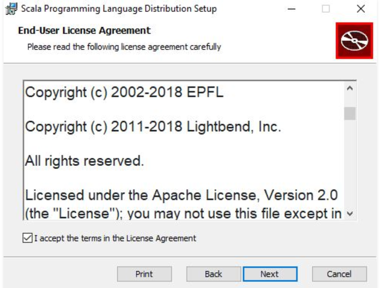

# learning-scala
Starting Scala Basic <br/>
---

**Installation**
---

This tutorial is based on windows system.<br/>

1. Step 1 - Verify Java version
    ````java
    C:\Users\Your_PC_username>java -version
    ````
    Output
    ````java
    java version "1.8.0_111"
    Java(TM) SE Runtime Environment (build 1.8.0_111-b14)
    Java HotSpot(TM) 64-Bit Server VM (build 25.111-b14, mixed mode)
    ````
    If Java is not installed then install latest Java SDK.<br/>
    [SDK Download](https://www.oracle.com/technetwork/java/javase/downloads/jdk12-downloads-5295953.html  "Oracle Java Download")

2. Step 2 - Install Scala<br/>
     [Scala Download](https://www.scala-lang.org/download/   "Scala Download")<br/>
     Run the downloaded **.msi** file. Follow below screenshots<br/>
     <br/>
     Click on the NEXT button<br/>
     <br/>
     Check the “I Agree Option” and then click NEXT<br/>
     <br/>
     Click on the INSTALL button.<br/>
     <br/>
     Click on the FINISH button<br/>
     <br/>
3. Step 3 - Test Installation
    ````java
   C:\Users\Your_PC_username>java -version
     ````
    <br/>
       


**Declare variable and types**<br/>

**Immutable Variable**<br/>

**Meaning** - values which can not be changed<br/>
**Declaration** - val <name>:scala:Type = <some_Literal><br/>
**Example** - val name:String = 'Scala' <br/>
**Note** - Reassignment is not possible. 

---

**Mutable variable**<br/>

**Meaning** - value can be changed<br/>
**Declaration** - var <name>:scala:type=<some_literal><br/>
**Example** - var name:String = 'Scala'<br/>

---

**Lazy Initialization**<br/>
**Meaning** -  Call by need means expression is not evaluated until it is needed<br/>
**Declaration** - lazy val <name> = <some_literal><br/>
**Pros**<br/>
1. Optimize computation, avoid wasted of CPU
2. resolve circular dependencies

**Cons**
1. Tricky in finding bugs 
2. Goes against conventional approach

---

**Blocks**<br/>
**Meaning** -  Combine expression by surrounding them {}. Last value will be evaluated in this case.<br/>
**Declaration** - println({ val x =1+23; x+1})<br/>

---

**Functions**<br/>
**Meaning** -  Expression which have parameters, and take arguments <br/>
**Declaration** - val multipleBythree = (x:Int) => x*3<br/>

---

**Method**<br/>
**Meaning** -  Similar to functions but method is always initialized with keyword **def**  and wil always return a value <br/>
**Declaration** - def multipleBythree(x:Int):Int = x*3<br/>

---

**Type Hierarchy**<br/>


**What is Nothing in bottom**

It is a subtype of everything of higher types. Commonly used to signal non-termination such as exception thrown, exit program or infinite loop. 

**Type Casting**<br/>


---

**Class**<br/>
**Meaning** -  A Scala class is defined with keyword **class** along with name and constructor parameters   <br/>
**Declaration** -<br/>
````Scala
class name(firstName:String,lastName:String){
    def fullName(greet:String):Unit =
      println(greet+' '+firstName+' '+lastName)
  }
  val textPrint = new name("Adarsh","Shukla")
  textPrint.fullName("Welcome to Canada!!!!!")
}
````
